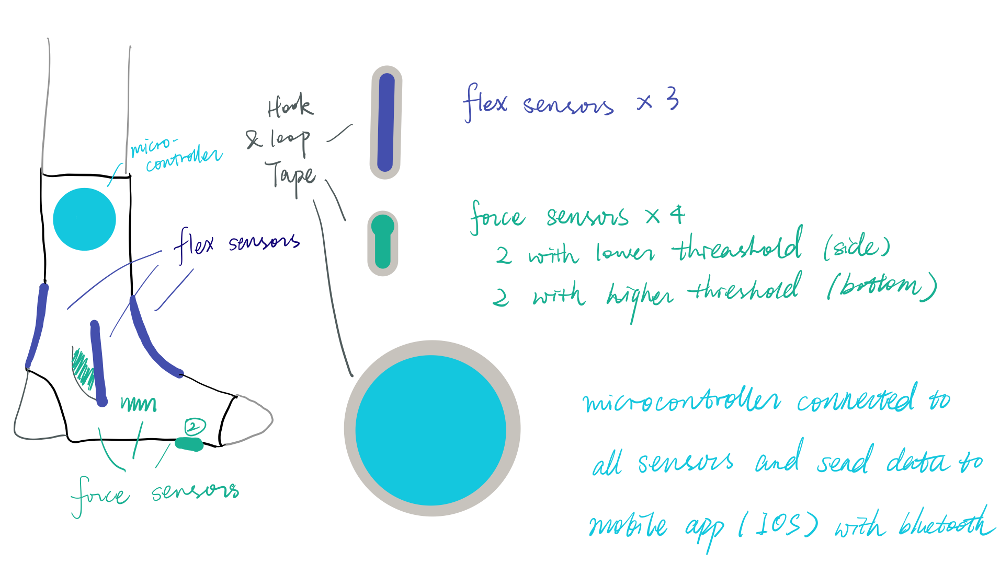
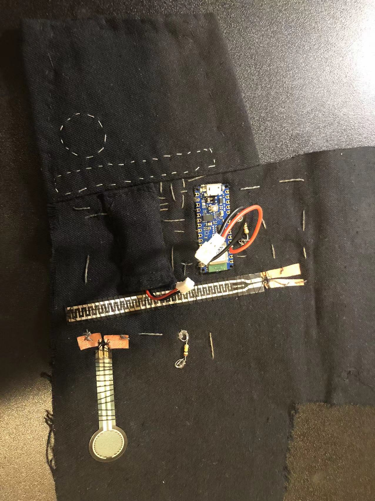

# Project Pitch - 10/3

I want to create a product, probably called ankle protector, that is aimed to help users preserved the correct gesture after they sprained their ankle(s). So, it is meant to be pragmatic and the potential audience might be those who sprained their ankles.

The detailed aim is to detect whether users twist their ankles too much, or have physical presses that are too heavy on their ankles, or lean toward one side of the foot to walk, which might be bad for the recovery process, at an early stage before users can notice to reduce harm. It can be connected to phone or web applications with Bluetooth (if possible) and warm users when it detects some wrong gestures.

The protector itself should ideally give the ankles some presses to help compression, which might help recovery similar to what elastic bandage does, but it is hard to determine the force so maybe we can start with existing ankle support braces or consider it if time permits.

# Project Post - 10/16

**Project title:** Ankle Protector

**Project team:** Yuren Sun

**Description:**

1. What does your project do?

The project aims at helping users detect whether their ankles are posited correctly and alarm the wrong positions during recovery from spraining ankles with sensors and mobile applications.

1. Who is your project for?

The users who sprained their ankles and during the recovery with ankle braces, compression wraps, etc. (not aimed at users who need to wear walker boots).

1. Describe how someone would use the developed device. What are the steps that a user would go through to interface with the technology?

The products will be sensors and microcontrollers placed on hook and loop tapes so that users need to stick the tapes to the desired position after wearing socks, ankle brace, or wraps. Then, they need to connect the microcontroller to their phone with Bluetooth and use the mobile app to check the data of the sensors. Default threshold will be set and can be changed to alert users of the wrong position (such as rotating too much or relying on one side of their feet) if the sensors read the data above thresholds from the mobile app.

1. What makes your project different from existing products?

The existing ankle brace or wraps help users posit their ankles with some compression. However, such compression is not enough to keep users posit their foot correctly (they can still rotate too much or have wrong movements that might delay the recovery). Therefore, my project aims to use sensors to help users detect whether they posit and rotate their feet correctly. As I use the hook & loop tapes to stick the projects to socks/braces/wraps, the project is also removable and reusable. Besides, as the sensors and microcontroller are combined onto tapes, the projects have the potential usages to other areas where bending and force need to be monitored by sticking sensors and microcontroller to the desired position.

**Project category:** Health

**Inspiration images:**

Common ankle braces or wraps, such as the ones in the image

 

**Sketches:**

**Materials:** flex sensors, force sensors, microcontroller with bluetooth, hook and loop tapes, conducting threads, phone or laptop (in the fallback plan)

**Skills:** General electronic such as using sensors with microcontroller, sewing, taking input from a microcontroller through Bluetooth, mobile applications development

**Timeline:**

- Milestone 1 (Nov 8): Collecting materials, accepting inputs of sensors to laptop with Bluetooth, starting app development
- Milestone 2 (Nov 29): IOS app development that takes input from Bluetooth, sewing the sensors to tapes
- Milestone 3 (Dec 13): Testing and prototyping, finalizing the product

**Fallback plan:**

There are two possible deductions from my project.

\1. Work with Apps on laptops instead of mobile Apps to save time developing and testing the integration of a mobile app while still be able to track and detect wrong movements when users

\2. Reduce the number of sensors used to monitor and detect the wrong movement to reduce time in reading input, input analyzing, and sewing.

I want to keep the minimal success to be having a mobile/laptop app that can monitor users' movements on their feet and alert/inform users when possible wrong movements were detected with sensors and a microcontroller.

# Project post - 10/24

**project title**: Ankle Protector

**project team**: Yuren Sun

**responses from comments** 

- For the comment on post #1
  - I already have ankle wraps so I can start with that. My idea is to use the hook part of hook and loop tapes to "stick" the sensors to the wrap/brace/socks so that they would be more flexible and I do not need to worry about whether the wrap/brace/sock is washable. I will start testing whether the hooks would stick the flex sensors to ankle tight enough after I leanred how to send inputs from sensor to my laptop with bluetooth. So far, I do a simple test to stick my hook tapes to my wrap and it seems to follow my ankle movements pretty well so I think it might also work well when I stick my flex sensors to it. If the hook tapes do not work well with flex sensors, I will buy a brace (it should be really quick) and sew my sensors and microcontroller to it. 
- Comments about which microcontroller to purchase
  - In Wednesday's class, I mentioned that the Arduino Nano 33 BLE was not availabe from their official website so I tend to use Adafruit ItsyBitsy nRF52840 Express - Bluetooth LE. After class, when I got home, I found that the Arduino one is available from Amazon so I purchased it as I found much more comments and tutorials about this one compared to Adafruit one.
- Comments during discussion
  - I realize that I only need one flex sensor to monitor the forward and backward rotating. I used to want two sensors at the front and back of the foot/ankle but realized that they should provide me with similar data.

**weekly accomplishments**

I purchased the microcontroller and just received it today. I start following the tutorials to try out the controller with Arduino IDE to see whether it works on my laptop. I do encounter the Bluetooth connection problems but it seems to work for most of the time so I think I can work with it. I tend to try using microcontoller with sensor but realized that I do not have resistors so that I am not able to connect sensors to the microcontroller. So, I was mostly working on exploring how to work with Arduino IDE and bluetooth.

**changes to your approach**

I tend to start with two pressure sensors at this time. The original plan was to have four pressure/force sensors, two on the side of the ankle and two at the bottom of foot. However,  I found that the price for the two placed on the bottom of foot to be pretty high (about $20) as they need to have higher force range to measure force when people stand on them. So I tend to make sure that the two cheaper one would work before purchasing the ones with higher prices.

Another changes are that I realized that I need to also have multiple resistors when connecting sensors.

**images** 

Here is the sketch of my project. The general idea is to stick all the sensors and microcontroller to the hoop part of hook and loop tapes, and users and stick them to the parts of their ankles where they want to monitor movements.

# Project post - 10/31

**responses from comments**

- for comments in class about the battery for the microcontroller - Purchased some female end of JST connector to use the battery provided in class from Amazon. Not sure whether those will work and I can return and try others if they do not work.

**weekly accomplishments**

I tried to use the flex and force sensors with the microcontroller and managed to send the analog input to the phone with nRF Connect App. The inputs are a little bit unstable as I did not sew the sensors firmly as I found it not possible to sew the threads on the hook part of hook & loop tapes so I will find some textiles to sew them to the textiles first next week. I also did some research on how to deal with those inputs with the APP that I will build but did not try them out yet.

**changes to your approach**

I tended to stick the sensors to the hook part of the hook & loop tapes but found it really hard to sew the conductive threads to the hook part so I will find some textiles to sew the materials to them and stick the textile to the hook part.

Another change is as the microcontroller does not have JST female end, I will purchase them and plan to solder them to the microcontroller to use the battery with a JST connector.

**areas of concern**

- Soldering - I need to solder the JST Female end to the microcontroller. I did it only once in high school and am not sure whether I could do it correctly now. ( I think we can desolder them but not sure whether we can do so to microcontrollers)
- Whether the sensors can catch the movements correctly - Before, I tended to stick the sensors to the tape directly so that they could follow the movements of the ankle but I am not sure whether they will still work fine when sewing them to textiles and sticking the textile to the hook tape. I will know more about this when I got some textiles to try this out. If they do not work, I will just purchase some ankle braces and sew them to the brace.

# Project post - 11/7

**responses from comments**

- Checked out how the sensors work. There bend well but there are problems with receiving data to the microcontroller after I sewed them to the textile. Spent some time trying troubleshooting but did not figure it out. 

**weekly accomplishments**

- I started developing the mobile app with react-native but am slow on this as the Bluetooth package is new to me
- I tested the sensors with the microcontroller before I sew them to make sure that they would be working. Some sensors work but some do not (maybe because that I the resistance of resisters that I use is too small? Not sure, will ask in class.) 
- I also checked where to sew each of the sensors, microcontroller, and battery and start putting them together. However, I encountered the problem that after I sew the microcontroller, resister, and sensor together onto the textile, the microcontroller keep getting the wrong data. I spend some time troubleshooting and also re-sew them but was still not able to figure it out (so I will probably ask in class about this.) 

**changes to your approach**

Just minor fixes on how to combine the components (positions, approaches from separated textiles to only a larger one.) Also changes some materials as some of them do not meet what I want so I returned and reordered other options. The links below are for the newly ordered options.

**areas of concern**

My concerns are mostly about the sensors. As described before, when I do testing before sewing sensors to the textile, some sensors do not work and I am not sure whether that is the problem for using a resister with small resistance as some others work. I also have the problem that after sewing the components to the working sensors and resister onto the textile, the sensor just does not send correct data. I will bring them and ask about this in class.

**images**

# Project post - 11/14

**responses from comments**

- Sensor not working after sewing - when troubleshooting this with professor Kevin in class, we believed that the problem is about the connections between conductive threads and sensor, and professor Kevin suggested trying soldering. I did not use soldering as it would fix the sensors with threads so I try using the copper paper (stick the copper paper to the textile, and tie the sensor to the copper paper with normal threads and connect copper paper with conductive threads) and it works now.

**weekly accomplishments**

- I got two sensors working after sewing them to the textile. I will work on the other two sensors after testing their resistance and get suitable resisters from class (just received my last sensor)
- I tried the female ends to connect batteries with JST male ends but it seems to be not working though the battery fit into the female end. I need to ask about this in class.
- I am still working on the mobile app but got stuck with the Bluetooth. There might be problems setting up the environment when using one package (react-native-ble-manager) that I am not able to initialize the Bluetooth manager even with the official example and not able to figure it out after trying many solutions online. I will switch to another package (react-native-ble-plx) and try this out this week. Or maybe could try swift or other coding languages.

**changes to your approach**

Just minor fixes on how to combine the components (copper paper to help connections between sensors and conductive threads).

**areas of concern**

- How to connect the battery with the JST end. As described above, I got the female ends that seem to match the JST male ends of the battery but also seem not to be working with the microcontroller. Not sure whether this is the problem with the cable or that I connect it incorrectly.
- The mobile app to connect to Bluetooth. I might switch to Swift if not able to work with the second package.

# Project post - 11/21

**Description:** Ankle protector with sensors tracking movements and gestures of the ankle, and IOS App to read sensor data and warm users for incorrect movements or gestures.

**responses from comments**

- JST female end not working - We figured it out in class that we just attached the positive and negative ends incorrectly. Will solder it to the microcontroller after connecting all the sensors.
- App with Bluetooth - we discussed in class that we need to make sure that the phone can detect the microcontroller with Bluetooth (and that my phone can detect it with other existing apps) and then agree to try the packages out and switch if not working

**weekly accomplishments**

- I tried sewing the other two sensors with the microcontroller but seems that I still got the wrong resistor. Will try again in class.
- I think that I made great progress on the ios app that I can read the sensor data continuously now. I spent some time trying the two packages with React Native (react-native-ble-manager and react-native-ble-plx) but neither of them works for me. So, I switch to Swift with Xcode, spent time learning how to set up the app, Bluetooth, and can now read the data (though with ugly and plain UI and did not figure out how to do notification but they should be much easier compared to reading data.)

**changes to your approach**

Just minor fixes on app development from using React Native to Swift.

**areas of concern**

- Not too much. I have a few concerns about choosing the right resistors by testing the resistance of the sensors, but since I did connect two sensors correctly before, maybe there just needs to be some more tests on the sensor resistors.

# Project post - 11/28

**Name changed**: Smart Ankle Sensor

**Description**: A technology-enhanced ankle brace that uses sensors to track incorrect movements and alerts the wearer to avoid further injury. 

**responses from comments**

- Sensor not working - changed the resistor and it is working now
- Suggested changes to description and name - change to the brainstormed name and the description suggested.

**weekly accomplishments**

- Had some updates on the iOS App, such as adding all the components needed and adding more functions such as enabling users to connect/disconnect when they want and setting the thresholds. Notifications to be added but found some useful documents to work with.
- Got all the functionalities for the sensors part working - the four sensors are now all working and the battery can be connected (did not solder the female end but used some threads to fix them as it fixed into the microcontroller pretty well.) Now working on masking all the components (another layer of textile on all the sensors to hide the circuits.)
- Add the hook part of the hook and loop tapes to it, but I still need to manually sew them to the textile as they do not stick to the textile well. I sewed the hooks behind the two sensors on the left sides and they (along with the sensors) worked well when sticking to the braces.

**changes to your approach**

Just minor changes - not using soldering as the female ends already fix well to the microcontroller and need to sew the hook part to the textile manually

**areas of concern**

Not so far. I got most of the functionalities working, and just need to combine all of them together and have more development on the app to do.

# Project post - 12/05

**responses from comments:** Thanks for all your helps on the project, and name and descriptions :D

**weekly accomplishments**

- Got the sensor part finished
- Got notification functions work for one sensor data, need to continue code for others, should be similar. Also, I tend to add notification functions when the app is running in the background if I have time next week :) but not a necessary part.
- Brainstorming about the icon of the App but not getting an ideal one, will skip this if there is not enough time on this.

**Images**

